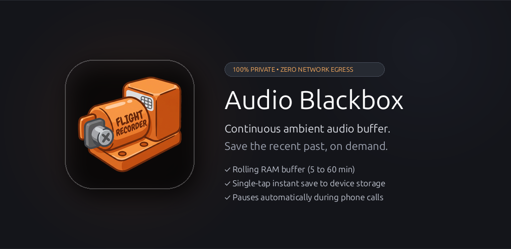
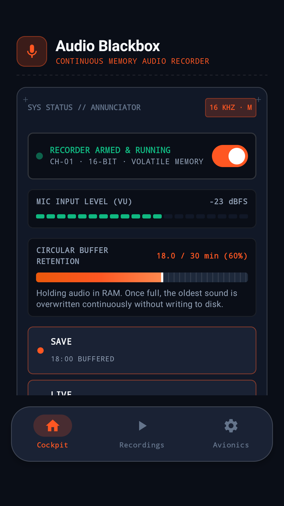
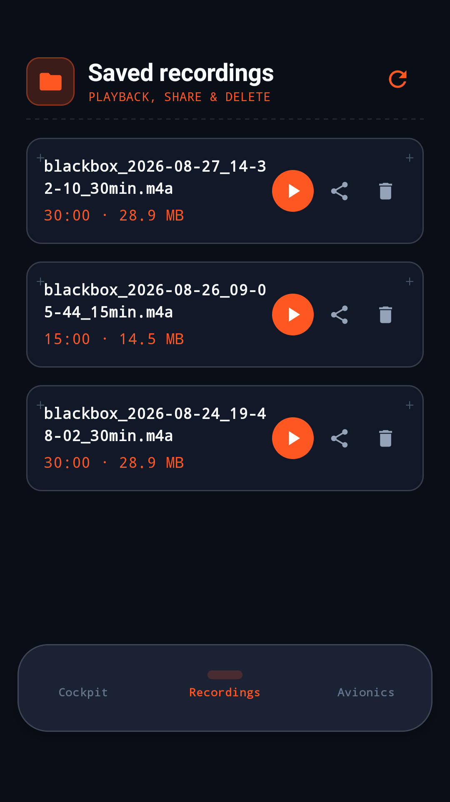
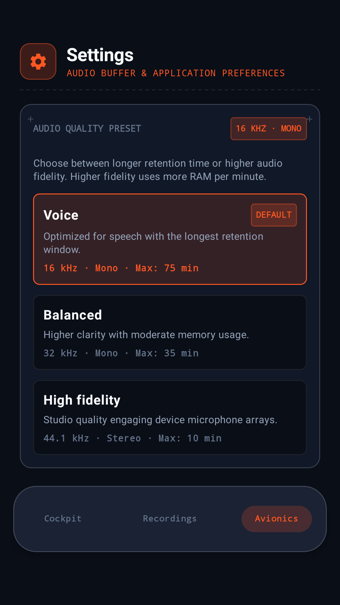

# Audio Blackbox

<p align="center">
  
</p>

<p align="center">
  <a href="https://github.com/alexandre-machado/audio-blackbox/actions/workflows/ci.yml"></a>
  <a href="LICENSE"></a>
  <a href="https://developer.android.com"></a>
  <a href="docs/release/privacy-policy.md"></a>
  <a href="https://m3.material.io"></a>
  <a href="https://play.google.com/apps/testing/cc.machado.audioblackbox"></a>
  <a href="https://alexandre.machado.cc/audio-blackbox"></a>
</p>

<p align="center">
  <b><a href="https://alexandre.machado.cc/audio-blackbox">alexandre.machado.cc/audio-blackbox</a></b>
</p>

---

**Audio Blackbox** is a continuous memory audio recorder for Android that functions like a flight recorder or dashcam for sound: it keeps a rolling window of recent audio (**5 to 45 minutes**, in 5-minute steps) in device RAM and writes to storage **only when you explicitly ask it to**.

Nothing touches your disk or leaves your phone until you press save. You can capture important conversations, ideas, or unexpected events *after* they have already happened.

---

## 📸 Screenshots

| Dashboard (Live VU Meter & Buffer RAM) | Saved Recordings Gallery | Audio Engine & Privacy Specs |
| :---: | :---: | :---: |
|  |  |  |

---

## ✨ Key Features

- 🎯 **Two Primary Capture Modes**:
  - **Save Recent Past (Lookback)**: Instantly snapshot everything currently buffered from the memory ring buffer into an AAC (`.m4a`) or lossless WAV file. One action, always the whole buffer -- the old 5/15/30 selector was retired in #121 because it promised windows the buffer might not hold.
  - **Continuous Live Recording**: Start a forward live recording that automatically preserves the preceding buffer timeline so nothing is lost.
- 📊 **Real-time Live VU Meter**: 18-capsule reactive microphone input level indicator built on Material 3 components, styled with the app's avionics/cockpit brand theme (see `AGENTS.md` §5).
- 💾 **Circular Buffer RAM Visualizer**: Live retention progress bar showing exact buffer saturation, duration, and memory utilization (at standard 16 kHz 16-bit PCM, 30 minutes uses just ~55 MB of RAM).
- 🛡️ **100% Local, Zero-Network Privacy**:
  - **Zero Network Permissions**: The `android.permission.INTERNET` permission is completely absent from the merged release manifest.
  - **Zero Telemetry / Crash SDKs**: No Firebase, no analytics, no third-party trackers.
  - **Local Persistence Only**: Files are saved directly to your device's standard `Recordings/Blackbox/` folder.
- ⚡ **Seamless Interruption Handling**: Pauses gracefully during phone calls or third-party audio focus grabs, preserving silence gaps to ensure exported timestamps remain perfectly synced.
- 🔋 **Robust Background Survival**: Dedicated foreground capture service with persistent notifications and guided manufacturer battery-killer bypass.
- 🎵 **Integrated Audio Player**: Playback, seek, manage, and share your recordings directly inside the app with native Android sharesheets.
- 🔘 **Quick Settings Tile**: Start and stop capture with a single tap from Android's Quick Settings panel.

---

## 🔬 Audio Engine Specifications

| Parameter | Specification | Details |
| :--- | :--- | :--- |
| **Internal Buffer** | 16-bit Linear PCM | Pre-allocated circular ring buffer in RAM |
| **Sample Rate** | 16,000 Hz (Standard) / 44,100 Hz | Optimized for voice clarity and low memory footprint |
| **Channel Config** | Mono (1 Channel) | Maximizes retention duration per megabyte |
| **Export Formats** | AAC LC (`.m4a`) & Lossless WAV | Hardware-accelerated `MediaCodec` streaming encoder |
| **Storage Destination** | `Recordings/Blackbox/` | Standard Android `MediaStore` collection |
| **Thread Architecture** | Dedicated Single-Writer | Capture thread performs zero disk I/O and zero IPC |

---

## ⚡ Hardware Efficiency & Power Benchmarks (Samsung Galaxy S25)

Measured live on physical **Samsung Galaxy S25 (`SM-S931B`, Android 16 / API 36)** during continuous recording (16 kHz Mono, Voice Preset):

| Metric / Resource | Background Capture (Screen Off) | Active Foreground (Dashboard UI) | Operational Invariant |
| :--- | :--- | :--- | :--- |
| **Battery Drain Rate** | **~1.0% – 1.5% / hour** (~45–60 mA) | ~7.0% – 9.0% / hour (display-bound) | Over **65+ hours** continuous recording autonomy |
| **Volatile Audio Buffer RAM** | **54.9 MB** (30 min retention window) | **54.9 MB** (30 min retention window) | Deterministic pre-allocation; zero mid-flight reallocations |
| **JVM Heap Footprint** | **~7.3 MB resident** (256 MB max budget) | **~16.3 MB resident** (256 MB max budget) | Minimal GC pressure; ring buffer writer allocates zero objects |
| **Storage Disk I/O** | **0 KB/s** (Zero disk writes) | **0 KB/s** (Zero disk writes) | Pure volatile RAM; zero flash memory wear |
| **CPU Utilization** | **< 1.0% CPU** | ~3.5% – 4.5% CPU (60fps VU meter) | Blocking native `AudioRecord` thread with zero busy-waiting |

---


## 📚 Engineering Studies: Deterministic Memory Limits

The Audio Blackbox memory limit is governed by strict, pre-calculated bounds rather than reacting dynamically to Android's memory pressure APIs (`onTrimMemory`). This is a deliberate engineering decision:

1. **Memory Warnings are Blind to Process Limits**: The OS broadcasts memory pressure warnings when the *entire system* is low on RAM. However, every Android application operates under a strict per-process limit (the Dalvik Heap Limit). If the app suddenly exceeds its own quota, the runtime immediately throws an `OutOfMemoryError` and crashes the app, without ever broadcasting an `onTrimMemory` warning.
2. **The 2x Re-allocation Trap**: Dynamically expanding an array in Kotlin requires allocating a new, larger array before garbage-collecting the old one. If we tried to "stretch" a 100 MB audio buffer to 150 MB, the app would briefly need 250 MB of contiguous memory, causing an instant fatal crash on most devices.
3. **The Safe 85% Ceiling**: Audio Blackbox queries the hard limit at startup (`Runtime.getRuntime().maxMemory()`), subtracts the live footprint, and caps the buffer safely at **85%** of the available headroom. We also reserve a **15%** overhead strictly for the export process.

This guarantees a **zero-risk recording loop**: the app never reallocates memory on the fly, never triggers Garbage Collector pauses that drop audio frames, and prevents crashes at the exact moment the user presses "Save".

## 📲 Download & Beta Testing

Audio Blackbox is available in open beta via Google Play:

1. **Join the Tester Group** $\rightarrow$ [Google Groups: ccmachadoaudioblackbox](https://groups.google.com/g/ccmachadoaudioblackbox)
2. **Accept the Web Test Invitation** $\rightarrow$ [Play Store Testing Portal](https://play.google.com/apps/testing/cc.machado.audioblackbox)
3. **Install on Device** $\rightarrow$ [Google Play Store](https://play.google.com/store/apps/details?id=cc.machado.audioblackbox)

---

## 🛠️ Developer & Build Guide

### Stack Binding
- **Language**: Kotlin 2.1+
- **UI Framework**: Jetpack Compose with Material 3 (1.4.0 stable)
- **Minimum SDK**: Android 10 (API 29)
- **Target SDK**: Android 16 (API 36 / 37 compile)
- **Build System**: Gradle with Kotlin DSL (`build.gradle.kts`)

### Local Build & Testing

Prerequisites: JDK 17 and Android SDK 37.

```bash
# Clone the repository
git clone https://github.com/alexandre-machado/audio-blackbox.git
cd audio-blackbox

# Run JVM Unit Tests & Localization Lints (Primary Pre-Merge Gate)
./gradlew testDebugUnitTest lintDebug

# Assemble Debug APK
./gradlew assembleDebug
```

For testing principles, non-vacuous mutation rules, and architecture invariants, see [`AGENTS.md`](AGENTS.md).

---

## ⚖️ Legal & Recording Regulations

Recording conversations may require one-party or all-party consent depending on your jurisdiction. Audio Blackbox is a tool; you are solely responsible for ensuring your use complies with local laws and privacy regulations.

---

## 📄 License

This project is licensed under the [GNU General Public License v3.0](LICENSE).
